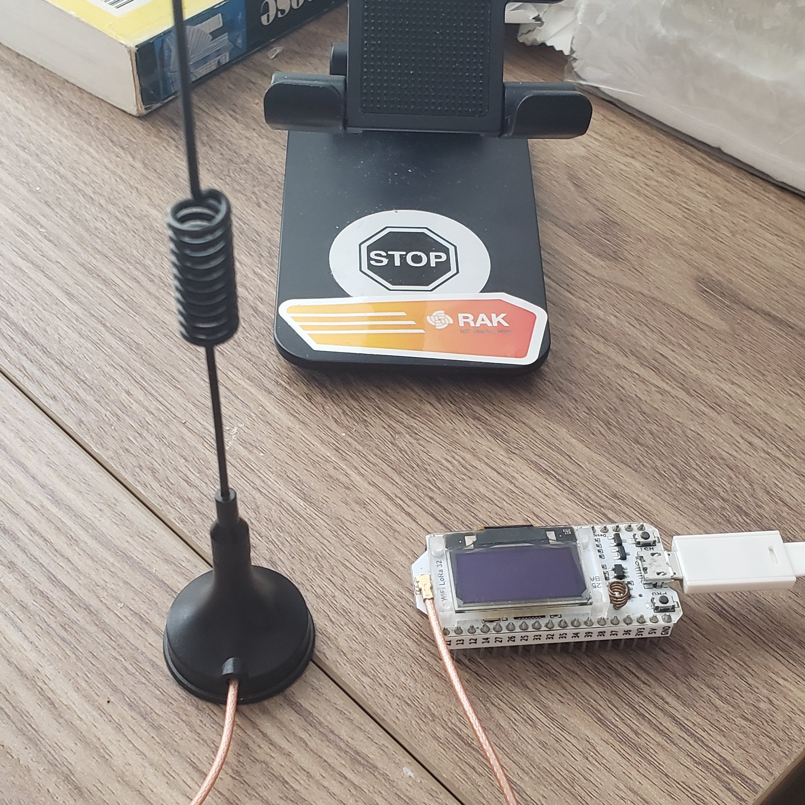

# ESP32_Minimal_LoRa

The ESP32 (sub)version of [BastWAN_Minimal_LoRa](https://github.com/Kongduino/BastWAN_Minimal_LoRa). All the EEPROM and BME680 features have been removed, the idea here was to make it work as quickly as possible. I will re-integrate functionalities later.

Tested with an old Heltec Wifi LoRa 32 (the 433 MHz version) with an 868 MHz antenna. :-) works!

